# 🏗️ Technical Architecture Documentation
## Continual ML System - Day 4

---

## 📋 System Overview

### **Architecture Principles**
- **Microservices Architecture** - Loosely coupled, independently deployable services
- **Event-Driven Design** - Automated workflows triggered by performance thresholds
- **Infrastructure as Code** - Docker Compose for reproducible deployments
- **API-First Design** - REST API as the core communication layer
- **Observability** - Comprehensive logging, monitoring, and alerting

### **Core Components**
1. **FastAPI Application** - Main ML API service
2. **Prefect Workflows** - Automated ML pipeline orchestration
3. **MLflow Tracking** - Experiment and model management
4. **SQLite Database** - Data persistence layer
5. **Streamlit Dashboard** - User interface
6. **Uptime Kuma** - Service monitoring
7. **GitHub Actions** - CI/CD pipeline

---

## 🔧 Infrastructure Architecture

### **Docker Compose Services**

```yaml
# Production-ready multi-service architecture
services:
  app:                    # FastAPI ML API
    build: .
    ports: ["8000:8000"]
    environment:
      - API_KEY=${API_KEY}
      - PERFORMANCE_THRESHOLD=${PERFORMANCE_THRESHOLD}
    
  streamlit:              # Web Dashboard
    build: .
    command: streamlit run streamlit_app.py
    ports: ["8501:8501"] 
    depends_on: [app]
    
  uptime-kuma:           # Service Monitoring
    image: louislam/uptime-kuma:latest
    ports: ["3001:3001"]
    volumes: ["uptime-kuma-data:/app/data"]
```

### **Network Architecture**
- **Internal Network** - Services communicate via Docker network
- **External Access** - Exposed ports for user interfaces
- **Health Checks** - Cross-service monitoring and dependency management

---

## 🧠 ML Pipeline Architecture

### **Data Flow Diagram**

```mermaid
graph TD
    A["Prefect Scheduler"] -->|"Every 30s"| B["Performance Check"]
    B -->|"Load Current Model"| C["SQLite Database"]
    B -->|"Calculate Metrics"| D["Model Evaluation"]
    
    D -->|"Performance < Threshold"| E["Trigger Retraining"]
    D -->|"Performance ≥ Threshold"| F["Discord: ✅ Model OK"]
    
    E -->|"Generate New Dataset"| G["make_classification"]
    G -->|"Store Training Data"| C
    E -->|"Train Model"| H["LogisticRegression"]
    H -->|"Log Experiment"| I["MLflow Tracking"]
    H -->|"Update Global Model"| J["In-Memory Model"]
    
    E -->|"Success"| K["Discord: 🔄 Retrained"]
    E -->|"Failure"| L["Discord: ❌ Training Failed"]
    
    M["API Requests"] -->|"/predict"| J
    J -->|"Predictions"| N["User Response"]
    
    O["Streamlit UI"] -->|"User Actions"| M
    P["GitHub Actions"] -->|"CI/CD"| Q["Test & Deploy"]
```



### **Model Lifecycle Management**

#### **1. Model Training Process**
```python
# Automated training pipeline
def retrain_model():
    # 1. Performance check
    if current_performance >= THRESHOLD:
        return "Retraining skipped"
    
    # 2. Data preparation
    X, y = load_training_data()
    
    # 3. Model training
    model = LogisticRegression(random_state=42)
    model.fit(X, y)
    
    # 4. Experiment tracking
    mlflow.log_metrics({"accuracy": model.score(X, y)})
    mlflow.sklearn.log_model(model, "model")
    
    # 5. Model deployment (hot-swap)
    global current_model
    current_model = model
    
    return "Model retrained successfully"
```

#### **2. Performance Monitoring**
- **Threshold-Based Retraining** - Only retrain when performance drops below 0.8
- **Real-time Metrics** - Continuous model performance evaluation
- **Automated Decisions** - No manual intervention required

#### **3. Model Persistence**
- **In-Memory Storage** - Fast prediction serving
- **MLflow Artifacts** - Model versioning and experiment history
- **Database Integration** - Training data persistence

---

## 🔌 API Architecture

### **FastAPI Application Structure**

```python
# Modular API design
app = FastAPI(title="Continual ML API")

# Security layer
security = HTTPBearer()
def verify_api_key(credentials): ...

# Core ML endpoints
@app.post("/predict")          # ML predictions
@app.post("/generate")         # Dataset generation  
@app.get("/health")            # Health checks
@app.get("/model-status")      # Model information

# Database layer
engine = create_engine("sqlite:///./ml_data.db")
SessionLocal = sessionmaker(bind=engine)

# Global state management
current_model = None
model_performance = 0.0
```

### **Authentication & Security**
- **Bearer Token Authentication** - API key protection for sensitive endpoints
- **Environment Variables** - Secure configuration management
- **Input Validation** - Pydantic models for request validation
- **Error Handling** - Graceful failure responses

### **Endpoint Specifications**

| Endpoint | Method | Auth | Purpose | Response |
|----------|--------|------|---------|----------|
| `/health` | GET | No | System health check | `200 OK` |
| `/model-status` | GET | No | Model performance info | Model metrics |
| `/predict` | POST | Yes | ML predictions | Prediction + confidence |
| `/generate` | POST | Yes | Create training dataset | Dataset confirmation |

---

## 📊 Data Architecture

### **Database Schema**

```sql
-- SQLite schema for training data
CREATE TABLE datasets (
    id INTEGER PRIMARY KEY,
    feature1 REAL NOT NULL,
    feature2 REAL NOT NULL,
    target INTEGER NOT NULL
);

-- Indexes for performance
CREATE INDEX idx_features ON datasets(feature1, feature2);
```

### **Data Flow**
1. **Dataset Generation** - `make_classification()` creates 2-feature linear data
2. **Storage** - SQLAlchemy ORM manages SQLite operations
3. **Training** - Batch loading for model training
4. **Persistence** - Transactional data integrity

### **MLflow Experiment Tracking**
```python
# Experiment management structure
mlflow.set_experiment("continual_ml")
with mlflow.start_run():
    # Parameters
    mlflow.log_param("model_type", "LogisticRegression")
    mlflow.log_param("n_samples", len(X))
    mlflow.log_param("performance_threshold", THRESHOLD)
    
    # Metrics  
    mlflow.log_metric("accuracy", score)
    
    # Artifacts
    mlflow.sklearn.log_model(model, "model")
```

---

## 🔄 Automation Architecture

### **Prefect Workflow Engine**

```python
# Automated ML pipeline
@task(retries=2, retry_delay_seconds=1)
def check_model_performance():
    """Evaluate current model and trigger retraining if needed"""
    random_value = random.random()  # Simulated performance metric
    
    if random_value < 0.5:  # Performance threshold
        send_discord_embed("🔄 Model drift detected. Retraining initiated.")
        # Trigger retraining process
        raise Exception("Retraining required")
    else:
        send_discord_embed("✅ Model performance OK")
        return "ok"

@flow
def continuous_ml_pipeline():
    """Main automation flow"""
    check_model_performance()

# Automated scheduling
continuous_ml_pipeline.serve(name="ml-monitor", interval=30)
```

### **Event-Driven Architecture**
- **Scheduled Triggers** - Time-based workflow execution
- **Performance Thresholds** - Automatic retraining decisions  
- **Notification System** - Discord webhooks for real-time alerts
- **Error Recovery** - Retry mechanisms with exponential backoff

---

## 🔍 Monitoring & Observability

### **Logging Architecture**

```python
# Structured logging with Loguru
from loguru import logger

# Application events
logger.info("Health check requested")
logger.success(f"Model retrained with accuracy: {score:.3f}")
logger.warning("Model performance below threshold")
logger.error(f"Prediction failed: {str(e)}")
```

### **Monitoring Stack**
1. **Uptime Kuma** - Service availability monitoring
2. **Loguru** - Structured application logging
3. **MLflow UI** - Experiment tracking dashboard
4. **Discord Webhooks** - Real-time notifications
5. **GitHub Actions** - CI/CD pipeline monitoring

### **Health Check Strategy**
- **API Health** - `/health` endpoint monitoring
- **Model Status** - `/model-status` performance tracking
- **Service Dependencies** - Cross-service health validation
- **Automated Alerts** - Immediate notification of issues

---

## 🛡️ Security Architecture

### **Authentication Flow**
```python
# Multi-layer security
1. API Key Authentication (Bearer tokens)
2. Environment variable isolation
3. Input validation (Pydantic)
4. Error sanitization
```

### **Security Measures**
- **API Key Protection** - Bearer token authentication
- **Environment Isolation** - `.env` file for sensitive data
- **Input Validation** - Pydantic schemas prevent injection
- **Error Handling** - No sensitive information in error responses
- **Access Control** - Public health checks, protected operations

---

## 🚀 Deployment Architecture

### **CI/CD Pipeline**

```yaml
# GitHub Actions workflow
name: CI/CD Pipeline
on: [push, pull_request]

jobs:
  test:
    runs-on: ubuntu-latest
    steps:
      - uses: actions/checkout@v4
      - uses: actions/setup-python@v5
      - uses: actions/cache@v4
      - name: Install dependencies
      - name: Run tests
      - name: Test app startup
```

### **Deployment Strategy**
- **Containerization** - Docker for consistent environments
- **Multi-stage Builds** - Optimized container images
- **Environment Parity** - Dev/staging/prod consistency
- **Zero-downtime Updates** - Hot model swapping
- **Rollback Capability** - Version-controlled deployments

---

## 📈 Scalability Considerations

### **Horizontal Scaling**
- **Stateless API Design** - Multiple API instances possible
- **External State Management** - Database and MLflow for persistence
- **Load Balancing** - Ready for multiple replicas
- **Container Orchestration** - Kubernetes-ready architecture

### **Performance Optimization**
- **In-memory Model Serving** - Fast prediction responses
- **Database Indexing** - Optimized data queries
- **Dependency Caching** - CI/CD performance improvements
- **Model Caching** - Reduced training frequency with thresholds

---

## 🔧 Configuration Management

### **Environment Variables**
```bash
# Security
API_KEY=your-secure-api-key-here
PERFORMANCE_THRESHOLD=0.8

# Services
FASTAPI_HOST=0.0.0.0
FASTAPI_PORT=8000
API_BASE_URL=http://localhost:8000

# Integrations
DISCORD_WEBHOOK_URL=https://discord.com/api/webhooks/your-url
MLFLOW_TRACKING_URI=file:///tmp/mlflow

# Streamlit
STREAMLIT_PASSWORD=admin123
```

### **Configuration Strategy**
- **Environment-based Config** - Different settings per environment
- **Secure Defaults** - Safe fallback values
- **Validation** - Configuration validation at startup
- **Documentation** - Clear configuration guides

---

## 🎯 Future Architecture Considerations

### **Days 5-8 Extensions**
Based on the [ContinualAI research](https://github.com/ContinualAI/continual-learning-papers), potential enhancements:

1. **Advanced ML Algorithms**
   - Catastrophic forgetting prevention
   - Elastic Weight Consolidation (EWC)
   - Progressive Neural Networks

2. **Real-time Processing**
   - Computer vision pipelines (YOLOv11)
   - Audio processing streams
   - WebRTC integration

3. **Async Processing**
   - Celery task queues
   - Background job processing
   - Distributed training

### **Production Readiness**
- **Multi-region Deployment** - Geographic distribution
- **Advanced Monitoring** - Prometheus + Grafana integration
- **Data Pipelines** - ETL processes for larger datasets
- **Model Governance** - A/B testing and gradual rollouts

---

## 📚 Technical Dependencies

### **Core Stack**
```python
# requirements.txt
fastapi==0.115.0           # Web framework
uvicorn==0.32.0           # ASGI server
prefect>=3.1              # Workflow orchestration
mlflow==2.8.1             # ML experiment tracking
scikit-learn==1.3.2       # ML algorithms
streamlit==1.28.1         # Dashboard UI
loguru==0.7.2             # Structured logging
```

### **Infrastructure**
- **Docker** - Containerization platform
- **Docker Compose** - Multi-service orchestration
- **SQLite** - Embedded database
- **GitHub Actions** - CI/CD platform
- **Uptime Kuma** - Service monitoring

---

This architecture provides a **solid foundation** for building production-ready continual learning systems, with clear separation of concerns, comprehensive monitoring, and automated workflows. The design is **extensible** and ready for the specialized AI projects planned for Days 5-8. 